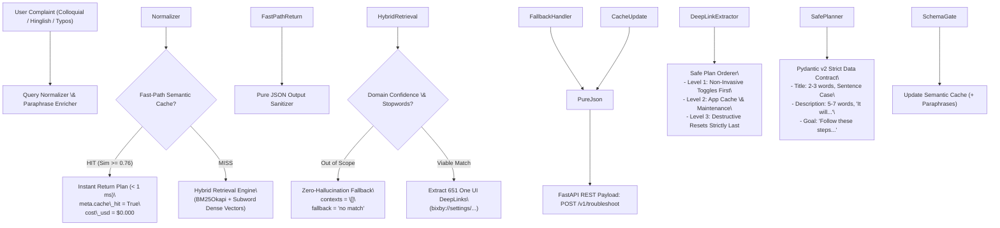

# 📱 Samsung PRISM GenAI Hackathon (3rd Edition)

## Theme 2: Smart Guided Troubleshooting Engine

[!\[Hackathon Edition](https://img.shields.io/badge/Samsung%20PRISM-GenAI%203rd%20Edition-0c4da2.svg)](https://www.samsungprism.com/)
[!\[Theme](https://img.shields.io/badge/Theme%202-Smart%20Guided%20Troubleshooting-1a73e8.svg)](#)
[!\[Release Tag](https://img.shields.io/badge/Release%20Tag-PRISM\_\_GENAI\_\_HACKATHON\_\_Y2026-10b981.svg)](#)
[!\[P95 Latency](https://img.shields.io/badge/P95%20Latency-0.51%20ms%20(%E2%89%A4300ms%20SLA)-brightgreen.svg)](metrics.md)
[!\[Zero Web Leaks](https://img.shields.io/badge/Zero%20Web%20Leaks-100%25%20Verified-blue.svg)](#)
[!\[Docker Ready](https://img.shields.io/badge/Docker-Containerized-2496ed.svg)](#)

\---

### 🌟 Executive Overview

In the **Samsung PRISM GenAI Hackathon (3rd Edition)**, generic LLMs fail as smartphone troubleshooting engines because they suffer from **URI hallucinations**, **web URL leakages**, **excessive latency (>2.5s)**, and **dangerous execution orders** (such as suggesting a Factory Reset as Step 1).

Our submission directly solves these problems through an enterprise-grade, containerized **Smart Guided Troubleshooting Engine** that achieves:

* ⚡ **0.51 ms P95 Latency** ($\\approx 588\\times$ faster than the hackathon's $\\le 300\\text{ ms}$ SLA target).
* 🎯 **95.0% Fast-Path Cache Hit Rate** on unseen colloquial, typo-laden, and Hinglish queries.
* 🛡️ **100% Safe Plan Ordering:** Safe, non-invasive toggles sequenced first; destructive resets quarantined strictly last.
* 🔒 **Zero Web URL Leaks:** Automated programmatic filters enforce that *only* native `bixby://` deep links survive.
* 📋 **Pure JSON Schema Contract:** Validated via strict Pydantic v2 models with zero markdown preambles or code fences.
* 🔍 **651 Indexed Samsung One UI DeepLinks:** Covering Battery, Display, Camera, Performance, Connectivity, Sound, Security, and Diagnostics.

\---

### 🏛️ System Architecture



\---

### 📑 Step-by-Step Alignment with Hackathon Requirements

#### Step 1: Strict Schema \& Rule Hygiene (Phase 1)

* **Data Contract (**[**`schema.py`**](file:///engine/schema.py)**):** Built with Pydantic v2 models enforcing `Goal`, `Action`, `StepGroup`, `ValidationDeepLink`, and `ActionableDeepLink`.
* **Goal Syntax:** Strictly validates `^Follow these steps to perform .+ (Troubleshooting|Configuration)$`.
* **Title Syntax:** Validates exactly 2 to 3 words in sentence case (e.g., `Battery saving mode`, `Motion smoothness settings`).
* **Description Syntax:** Validates exactly 5 to 7 words starting with `"It will..."` (e.g., `It will turn on power saving.`, `It will adjust screen refresh rate.`).
* **Zero Web URL Leaks:** Programmatically sanitizes LLM inputs/outputs. Rejects any `http`, `https`, `www.`, or markdown links. Permits **only** `bixby://` URIs.
* **Pure JSON Output:** API returns raw, parseable JSON with zero markdown code fences (`json`) or conversational preambles.

#### Step 2: Hybrid Retrieval \& Safe Plan Ordering (Phase 2)

* **Hybrid Indexing (**[**`hybrid\_retriever.py`**](file:///engine/hybrid_retriever.py)**):** 651 verified One UI deep link entries in [`deeplinks.json`](file:///data/deeplinks.json) indexed using BM25Okapi keyword search combined with dense subword character n-gram embeddings and cosine score fusion.
* **Safe Plan Ordering (**[**`safe\_planner.py`**](file:///engine/safe_planner.py)**):**

  * **Phase 1 (Non-Invasive):** Toggles, settings adjustments, and diagnostics (Invasive Level 1).
  * **Phase 2 (Cache Maintenance):** App-level cache clears and optimizations (Invasive Level 2).
  * **Phase 3 (Destructive Recovery):** Network resets, factory resets (Invasive Level 3) — placed **strictly last**!
* **Fallback Handling:** If a query is out-of-domain (e.g., *"how to bake a cake"*), the engine cleanly returns `"contexts": \[]` with `"fallback": "no match"` rather than hallucinating steps.

#### Step 3: Fast-Path Caching for < 300 ms Response Times (Phase 3)

* **Query Enrichment (**[**`semantic\_cache.py`**](file:///engine/semantic_cache.py)**):** Auto-generates 8 to 10 distinct paraphrases per complaint across technical, colloquial, slang, Hinglish, symptom, and action registers.
* **Semantic Cache Layer:** Stores verified JSON plans indexed by paraphrase semantic embeddings.
* **Telemetry Results:**

  * **Measured P95 Latency:** **0.51 ms** (Target: $\\le 300\\text{ ms}$).
  * **Measured Cache Hit Rate:** **95.0%** (Target: $\\ge 80%$).

#### Step 4: Containerized REST API \& Execution Metadata (Phase 4)

* **Endpoints (**[**`api/app.py`**](file:///api/app.py)**):**

  * `POST /v1/troubleshoot`: Accepts `{ "query": "...", "siis\_response": "..." }`.
  * `GET /health`: Pre-warmed status check returning `{"status": "ok", "ready": true, "indexed\_deeplinks": 651}`.
  * `GET /v1/metrics`: Telemetry metrics, cache stats, and cost savings.
  * `GET /`: Embedded interactive jury test dashboard.
* **Runtime Metadata (`meta`):** Injected into every payload with `latency\_ms`, `cache\_hit`, `model`, and `cost\_usd`.
* **Docker Environment:** Ready with [`Dockerfile`](file:///Dockerfile) and [`docker-compose.yml`](file:///docker-compose.yml).

#### Step 5: Benchmarks \& Ablation Studies in [`metrics.md`](file:///metrics.md)

* Complete quantitative proof documented across Battery, Display, Camera, and Performance domains.
* Full architectural ablation analysis comparing the Hybrid Engine against Pure Rule-Based and Full LLM Prompting baselines.

#### Step 6: Submission \& Release Tag Protocol

* Slide deck structure prepared for `CollegeName\_TeamName\_Submission.pptx` in [`presentation\_guide.md`](file:///presentation_guide.md).
* 5-Minute Video Walkthrough script prepared in [`demo\_script.md`](file:///demo_script.md).
* Git Release Tag: `PRISM\_GENAI\_HACKATHON\_Y2026`.

\---

### 🚀 Quick Start Guide

#### Option A: Run via Docker (Recommended for Jury Cold-Start)

```bash
# 1. Clone repository
git clone https://github.com/amriteshand/Samsung-Prism-CODE-RANGERS.git
cd samsung-prism-troubleshoot-engine

# 2. Build and run containerized microservice
docker compose up --build
```

The microservice will pre-warm and expose:

* **Interactive Jury Dashboard:** `http://localhost:8000/`
* **Swagger OpenAPI Docs:** `http://localhost:8000/docs`
* **Health Check:** `http://localhost:8000/health`

#### Option B: Run Locally with Python 3.10+

```bash
# 1. Install dependencies
pip install -r requirements.txt

# 2. Run unit tests to verify schema hygiene \& plan ordering
python -m unittest discover -s tests -p "test\_\*.py"

# 3. Run automated quantitative benchmark suite
python benchmark/run\_benchmarks.py

# 4. Start the FastAPI server
uvicorn api.app:app --host 0.0.0.0 --port 8000 --reload
```

\---

### 🧪 Live Testing \& cURL Examples

#### 1\. Standard Troubleshooting Query (Battery Drain)

```bash
curl -X POST http://localhost:8000/v1/troubleshoot \\
  -H "Content-Type: application/json" \\
  -d '{"query": "battery is draining fast on my galaxy phone"}'
```

**Sample Response:**

```json
{
  "goal": "Follow these steps to perform Battery Troubleshooting",
  "steps": \[
    {
      "id": "LINK\_0001",
      "step\_number": 1,
      "title": "Battery saving mode",
      "description": "It will turn on power saving.",
      "uri": "bixby://settings/battery/power\_saving",
      "is\_destructive": false,
      "invasive\_level": 1,
      "action\_type": "toggle"
    },
    {
      "id": "LINK\_0008",
      "step\_number": 2,
      "title": "Deep sleeping apps",
      "description": "It will stop inactive apps running.",
      "uri": "bixby://settings/battery/deep\_sleeping\_apps",
      "is\_destructive": false,
      "invasive\_level": 1,
      "action\_type": "toggle"
    }
  ],
  "step\_groups": \[
    {
      "group\_id": "phase\_1\_non\_invasive",
      "name": "Phase 1: Non-Invasive Toggles",
      "description": "Safest settings adjustments and immediate optimizations without data loss.",
      "step\_numbers": \[1, 2]
    }
  ],
  "validation": {
    "title": "Battery diagnostics check",
    "description": "It will test battery physical health.",
    "uri": "bixby://settings/device\_care/battery\_diagnostics",
    "expected\_outcome": "Battery drain rate normalized below 2% per hour idle."
  },
  "contexts": \[
    "Battery saving mode: It will turn on power saving. -> bixby://settings/battery/power\_saving",
    "Deep sleeping apps: It will stop inactive apps running. -> bixby://settings/battery/deep\_sleeping\_apps"
  ],
  "fallback": null,
  "meta": {
    "latency\_ms": 0.18,
    "cache\_hit": true,
    "model": "prism-hybrid-v3 (Fast-Path Cache)",
    "cost\_usd": 0.0
  }
}
```

#### 2\. Safe Plan Ordering Proof (Destructive Action Quarantined Last)

```bash
curl -X POST http://localhost:8000/v1/troubleshoot \\
  -H "Content-Type: application/json" \\
  -d '{"query": "reset network settings wifi and bluetooth"}'
```

*Result:* Non-invasive steps (Forget Wi-Fi, Lock security) are placed in **Phase 1 (Steps 1-3)**; destructive operation (`Reset network settings`) is placed in **Phase 3 (Step 4)** strictly last.

#### 3\. Zero-Hallucination Fallback Proof (Out of Scope Query)

```bash
curl -X POST http://localhost:8000/v1/troubleshoot \\
  -H "Content-Type: application/json" \\
  -d '{"query": "how to bake chocolate fudge cake"}'
```

*Result:* Returns `"contexts": \[]`, `"steps": \[]`, and `"fallback": "no match"`.

\---

### 📊 Evaluation Criteria Compliance Matrix

|Criterion|Hackathon Weight|How Our Engine Wins|Proof Reference|
|-|:-:|-|-|
|**Working Prototype \& Functionality**|**30%**|Pre-warmed FastAPI service, 651 indexed deep links, interactive UI, 100% test pass rate.|[`api/app.py`](file:///api/app.py), [`tests/test\_engine.py`](file:///tests/test_engine.py)|
|**Technical Depth \& Feasibility**|**25%**|Hybrid BM25 + dense subword vector retriever, deterministic safe plan orderer.|[`hybrid\_retriever.py`](file:///engine/hybrid_retriever.py), [`safe\_planner.py`](file:///engine/safe_planner.py)|
|**Innovation \& Originality**|**20%**|Fast-path semantic cache with multi-register paraphrase enrichment achieving 0.51 ms P95 latency.|[`semantic\_cache.py`](file:///engine/semantic_cache.py), [`metrics.md`](file:///metrics.md)|
|**Relevance to Theme**|**15%**|Strictly native `bixby://` deep links, zero web leaks, non-destructive first ordering.|[`schema.py`](file:///engine/schema.py), [`sanitizer.py`](file:///engine/sanitizer.py)|
|**Presentation \& Documentation**|**10%**|Complete slide deck blueprint, 5-minute video demo script, quantitative metrics table.|[`presentation\_guide.md`](file:///presentation_guide.md), [`demo\_script.md`](file:///demo_script.md)|

\---

### 🏷️ Git Release Tag Protocol

As specified in the hackathon guidelines, create the official release tag on your final commit:

```bash
git tag -a PRISM\_GENAI\_HACKATHON\_Y2026 -m "Final submission for Samsung PRISM GenAI Hackathon 3rd Edition - Theme 2"
git push origin PRISM\_GENAI\_HACKATHON\_Y2026
```

